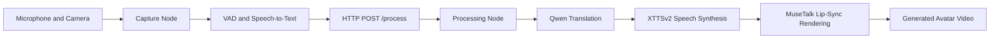

# Distributed AI Voice Translation and Lip-Sync Pipeline

A distributed, GPU-accelerated multimedia pipeline for LAN-based speech capture, Persian-to-English translation, neural text-to-speech synthesis, and high-fidelity lip-sync video generation.

This project is designed around a two-node laptop setup: one machine captures and transcribes the speaker in real time, while a stronger processing node performs translation, voice synthesis, facial animation, and final video playback.

## Table of Contents

- [Overview](#overview)
- [Repository Scope](#repository-scope)
- [System Architecture](#system-architecture)
- [Pipeline Flow](#pipeline-flow)
- [Core Components](#core-components)
- [Hardware Requirements](#hardware-requirements)
- [Software Requirements](#software-requirements)
- [Repository Layout](#repository-layout)
- [Model and Asset Layout](#model-and-asset-layout)
- [Installation](#installation)
- [Configuration](#configuration)
- [Execution](#execution)
- [API Reference](#api-reference)
- [Voice and Avatar Preparation](#voice-and-avatar-preparation)
- [MuseTalk Notes](#musetalk-notes)
- [Wav2Lip and GFPGAN Fallback](#wav2lip-and-gfpgan-fallback)
- [Client Node Integration](#client-node-integration)
- [Validation and Smoke Tests](#validation-and-smoke-tests)
- [Performance Notes](#performance-notes)
- [Troubleshooting](#troubleshooting)
- [Operational Security](#operational-security)
- [Licensing and Model Usage](#licensing-and-model-usage)

## Overview

The pipeline converts live or captured Persian speech into an English-speaking avatar video. It combines automatic speech recognition, a local large language model, voice cloning text-to-speech, and neural lip synchronization.

The intended end-to-end workflow is:

1. Capture user audio and camera input on the client node.
2. Detect voice activity and transcribe speech with Whisper or Faster-Whisper.
3. Send the recognized Persian text to the processing server over HTTP.
4. Translate the text to English using Qwen 2.5 Instruct through `llama.cpp`.
5. Generate English speech using Coqui XTTSv2 with `speaker.wav` as the reference voice.
6. Render lip-synced avatar video using MuseTalk 1.5.
7. Play or export the generated video on the server node.

## Repository Scope

This repository currently contains the server-side implementation and local model assets for the generative processing node.

Included in this workspace:

- `rtx_4070_musetalk.py`: primary FastAPI server that runs Qwen, XTTSv2, and MuseTalk.
- `rtx_4070.py`: alternative FastAPI server that runs Qwen, XTTSv2, Wav2Lip, and optional GFPGAN enhancement.
- `record_voice.py`: helper utility for recording `speaker.wav`.
- `MuseTalk/`: vendored MuseTalk inference code, configs, and local model folders.
- `Wav2Lip/`: vendored Wav2Lip fallback implementation.
- `offline_xtts/`: local XTTSv2 model files.
- `models/`: root-level model assets, including Qwen and Whisper variants.
- `speaker.wav`, `avatar.mp4`, and generated temporary or final video assets.

The capture/transcription client described by the distributed architecture is expected to run on a separate machine. A root-level `main.py` client entry point is referenced by the design, but it is not present in the current repository snapshot. Any compatible client can be used as long as it sends the required JSON payload to the server's `/process` endpoint.

## System Architecture

The architecture is split into two nodes connected over a local network.



### Capture and Transcription Node

Recommended hardware:

- NVIDIA GeForce RTX 3070 Laptop GPU or better.
- Integrated or external microphone.
- Integrated or external webcam.
- Stable LAN connection to the server node.

Recommended operating system:

- Linux distribution with CUDA-compatible NVIDIA drivers.

Responsibilities:

- Continuous audio capture.
- Optional webcam capture.
- Voice Activity Detection.
- Speech-to-text transcription using Whisper or Faster-Whisper.
- HTTP transmission of recognized Persian text to the processing server.

### Generative Processing Node

Recommended hardware:

- NVIDIA GeForce RTX 4070 Laptop GPU or better.
- At least 8 GB VRAM.
- 32 GB system RAM recommended.
- NVMe SSD strongly recommended for model loading and temporary video writes.

Recommended operating system:

- Windows 10 or Windows 11, 64-bit.

Responsibilities:

- Serve a FastAPI API on port `8000`.
- Load the Qwen GGUF model through `llama-cpp-python`.
- Generate speech with local Coqui XTTSv2 assets.
- Render lip-sync video with MuseTalk 1.5.
- Optionally render with Wav2Lip and improve output with GFPGAN.

## Pipeline Flow

The primary server path is implemented in `rtx_4070_musetalk.py`.

```text
Incoming text_fa
    |
    v
Qwen 2.5 1.5B Instruct GGUF
    |
    v
English translation
    |
    v
Coqui XTTSv2
    |
    v
temp_english.wav
    |
    v
Dynamic MuseTalk YAML config
    |
    v
MuseTalk inference
    |
    v
MuseTalk/results/v15/*.mp4
```

The fallback path is implemented in `rtx_4070.py`.

```text
Incoming text_fa
    |
    v
Qwen 2.5 1.5B Instruct GGUF
    |
    v
Coqui XTTSv2
    |
    v
Wav2Lip
    |
    v
GFPGAN enhancement
    |
    v
ultra_avatar.mp4
```

## Core Components

| Component | Role | Local Path |
| --- | --- | --- |
| FastAPI | HTTP server for LAN requests | `rtx_4070_musetalk.py`, `rtx_4070.py` |
| Qwen 2.5 Instruct | Persian-to-English translation | `models/qwen2.5-1.5b-instruct-q8_0/` |
| llama.cpp | Local GGUF inference backend | Python package `llama-cpp-python` |
| Coqui XTTSv2 | Voice synthesis and voice cloning | `offline_xtts/` |
| MuseTalk 1.5 | Primary lip-sync renderer | `MuseTalk/` |
| DWPose / MMPose | Face landmark and pose extraction | `MuseTalk/models/dwpose/` |
| Whisper Tiny | Audio feature encoder for MuseTalk | `MuseTalk/models/whisper/` |
| Wav2Lip | Fallback lip-sync renderer | `Wav2Lip/` |
| GFPGAN | Optional face enhancement | `GFPGANv1.4.pth`, `gfpgan/` |
| FFmpeg | Video/audio muxing and frame extraction | System PATH or configured binary path |

## Hardware Requirements

### Minimum Server Node

- NVIDIA GPU with CUDA support and 8 GB VRAM.
- 16 GB RAM.
- 20 GB free disk space for model assets and generated intermediates.
- CUDA-compatible NVIDIA driver.

### Recommended Server Node

- NVIDIA GeForce RTX 4070 Laptop GPU or better.
- 32 GB RAM.
- NVMe Gen4 SSD.
- Windows 10 or Windows 11 64-bit.
- Wired LAN or low-latency Wi-Fi.

### Minimum Client Node

- NVIDIA GeForce RTX 3070 Laptop GPU or equivalent for local Whisper acceleration.
- Working microphone.
- Optional webcam if the client is responsible for camera capture.
- Linux with NVIDIA driver and CUDA-compatible PyTorch.

## Software Requirements

The local environment currently validated in this workspace uses:

| Package | Version |
| --- | --- |
| Python | 3.11.2 |
| CUDA runtime used by PyTorch | 12.1 |
| PyTorch | 2.1.2+cu121 |
| TorchVision | 0.16.2+cu121 |
| TorchAudio | 2.1.2+cu121 |
| NumPy | 1.26.4 |
| MMCV | 2.1.0 |
| MMDetection | 3.2.0 |
| MMPose | 1.3.2 |
| TTS | 0.22.0 |
| llama-cpp-python | 0.3.4 |
| OpenCV | 4.9.0.80 |
| FastAPI | 0.137.2 |
| Uvicorn | 0.49.0 |

Important compatibility rule:

- Keep PyTorch on `2.1.2+cu121` for the current OpenMMLab stack.
- Keep `numpy<2` to avoid binary compatibility issues with OpenCV, scikit-image, MMCV, and related native packages.
- Install `llama-cpp-python` from a CUDA wheel when possible. Building from source on Windows requires Visual Studio Build Tools, CMake, and a working compiler toolchain.

## Repository Layout

```text
API_ART/
|-- README.md
|-- rtx_4070_musetalk.py
|-- rtx_4070.py
|-- record_voice.py
|-- speaker.wav
|-- avatar.mp4
|-- temp_english.wav
|-- final_avatar.mp4
|-- ultra_avatar.mp4
|-- GFPGANv1.4.pth
|-- models/
|   |-- qwen2.5-1.5b-instruct-q8_0/
|   |-- faster-whisper-large-v3/
|   |-- faster-whisper-large-v3-turbo-ct2/
|   |-- whisper-base/
|   |-- sd-vae-ft-mse/
|   |-- musetalk/
|-- offline_xtts/
|   |-- config.json
|   |-- model.pth
|   |-- vocab.json
|   |-- speakers_xtts.pth
|   |-- dvae.pth
|   |-- mel_stats.pth
|-- MuseTalk/
|   |-- scripts/
|   |-- configs/
|   |-- musetalk/
|   |-- models/
|   |-- results/
|-- Wav2Lip/
|   |-- inference.py
|   |-- checkpoints/
|   |-- models/
|-- gfpgan/
|   |-- weights/
|-- temp/
```

Generated files such as `temp_english.wav`, `final_avatar.mp4`, `ultra_avatar.mp4`, `temp_hq_video.mp4`, `temp/result.avi`, and files under `MuseTalk/results/` are runtime artifacts and can be regenerated.

## Model and Asset Layout

The server expects several model files to exist at fixed paths.

### Root-Level Qwen Model

```text
models/
|-- qwen2.5-1.5b-instruct-q8_0/
|   |-- qwen2.5-1.5b-instruct-q8_0.gguf
|   |-- imatrix.dat
```

Referenced by:

```python
QWEN_MODEL_PATH = "./models/qwen2.5-1.5b-instruct-q8_0/qwen2.5-1.5b-instruct-q8_0.gguf"
```

### XTTSv2 Offline Model

```text
offline_xtts/
|-- config.json
|-- model.pth
|-- vocab.json
|-- speakers_xtts.pth
|-- dvae.pth
|-- mel_stats.pth
|-- LICENSE.txt
```

Referenced by:

```python
tts = TTS(model_path="offline_xtts", config_path="offline_xtts/config.json").to("cuda")
```

### MuseTalk Model Assets

The MuseTalk process runs with `cwd="MuseTalk"`, so paths are resolved relative to the `MuseTalk/` directory.

```text
MuseTalk/
|-- models/
|   |-- musetalk/
|   |   |-- config.json
|   |   |-- musetalk.json
|   |-- musetalkV15/
|   |   |-- unet.pth
|   |   |-- musetalk.json
|   |-- dwpose/
|   |   |-- dw-ll_ucoco_384.pth
|   |-- face-parse-bisent/
|   |   |-- 79999_iter.pth
|   |   |-- resnet18-5c106cde.pth
|   |-- sd-vae-ft-mse/
|   |   |-- config.json
|   |   |-- diffusion_pytorch_model.bin
|   |-- whisper/
|       |-- config.json
|       |-- preprocessor_config.json
|       |-- pytorch_model.bin
|       |-- model.safetensors
|       |-- tokenizer.json
|       |-- vocab.json
|       |-- merges.txt
```

Critical configuration:

- `MuseTalk/models/musetalk/config.json` must use `cross_attention_dim: 384`.
- A root-level `models/musetalk/config.json` with `cross_attention_dim: 768` is not suitable for the current MuseTalk v1.5 execution path.

### Wav2Lip and GFPGAN Assets

```text
Wav2Lip/
|-- checkpoints/
|   |-- wav2lip_gan.pth

GFPGANv1.4.pth

gfpgan/
|-- weights/
|   |-- detection_Resnet50_Final.pth
|   |-- parsing_parsenet.pth
```

## Installation

These commands target the Windows processing node.

### 1. Create and Activate Virtual Environment

```powershell
py -3.11 -m venv .venv
.\.venv\Scripts\Activate.ps1
python -m pip install --upgrade pip setuptools wheel
```

Python 3.10 is also a safe choice for OpenMMLab-based projects. The current local environment has been validated with Python 3.11.2.

### 2. Install PyTorch with CUDA 12.1

```powershell
pip install torch==2.1.2 torchvision==0.16.2 torchaudio==2.1.2 --index-url https://download.pytorch.org/whl/cu121
```

Verify CUDA visibility:

```powershell
python -c "import torch; print(torch.__version__); print(torch.version.cuda); print(torch.cuda.is_available())"
```

Expected output should include:

```text
2.1.2+cu121
12.1
True
```

### 3. Install Core Server Dependencies

```powershell
pip install fastapi uvicorn pydantic
pip install TTS==0.22.0 sounddevice soundfile
pip install opencv-python==4.9.0.80
pip install "numpy<2" networkx==2.8.8 scikit-image==0.21.0
```

### 4. Install llama-cpp-python CUDA Wheel

Use a binary wheel to avoid local C++ compilation on Windows.

```powershell
pip install llama-cpp-python==0.3.4 --extra-index-url https://abetlen.github.io/llama-cpp-python/whl/cu121 --only-binary=llama-cpp-python
```

If pip attempts to compile from source and fails with `nmake` or compiler errors, keep `--only-binary=llama-cpp-python` and make sure the CUDA wheel index is included.

### 5. Install OpenMMLab Stack

```powershell
pip install openmim
mim install "mmcv==2.1.0"
pip install "mmdet>=3.0.0,<3.3.0"
pip install mmpose==1.3.2
```

### 6. Install MuseTalk Runtime Dependencies

```powershell
pip install diffusers==0.27.2 transformers==4.39.3
pip install accelerate omegaconf ffmpeg-python "imageio[ffmpeg]" einops tqdm
```

The upstream `MuseTalk/requirements.txt` contains a broader dependency set. Use it as a reference, but keep the PyTorch, NumPy, and OpenMMLab versions pinned as above.

### 7. Optional Fallback Dependencies

Required only for `rtx_4070.py` with Wav2Lip and GFPGAN enhancement.

```powershell
pip install gfpgan==1.3.8 basicsr==1.4.2 facexlib==0.3.0
```

### 8. Install FFmpeg

FFmpeg must be available to MuseTalk and Wav2Lip.

Recommended setup:

1. Download a Windows FFmpeg build.
2. Add the `bin` directory to the system `PATH`.
3. Verify from a new terminal:

```powershell
ffmpeg -version
```

The fallback server `rtx_4070.py` currently contains this hardcoded merge path:

```python
ffmpeg_path = r"C:\ffmpeg-8.1.1\bin\ffmpeg.exe"
```

Update it if FFmpeg is installed elsewhere.

## Configuration

### Server Host and Port

Both server scripts bind to all interfaces on port `8000`:

```python
uvicorn.run(app, host="0.0.0.0", port=8000, log_level="warning")
```

The client should use the LAN IP address of the processing node:

```text
http://SERVER_LAN_IP:8000/process
```

Example:

```text
http://192.168.1.20:8000/process
```

### Windows Firewall

Allow inbound TCP traffic on port `8000` if the client cannot connect.

Example administrative command:

```powershell
netsh advfirewall firewall add rule name="AI Voice Server 8000" dir=in action=allow protocol=TCP localport=8000
```

### Primary Server Paths

`rtx_4070_musetalk.py` uses these default paths:

```python
QWEN_MODEL_PATH = "./models/qwen2.5-1.5b-instruct-q8_0/qwen2.5-1.5b-instruct-q8_0.gguf"
SPEAKER_WAV_PATH = "./speaker.wav"
AVATAR_VIDEO_PATH = "./avatar.mp4"
TEMP_AUDIO_PATH = "./temp_english.wav"
```

### MuseTalk Dynamic Config

For each request, `rtx_4070_musetalk.py` rewrites:

```text
MuseTalk/configs/inference/live_test.yaml
```

The generated YAML points to absolute video and audio paths:

```yaml
task_0:
  video_path: "C:/Users/GwT/PycharmProjects/API_ART/avatar.mp4"
  audio_path: "C:/Users/GwT/PycharmProjects/API_ART/temp_english.wav"
  bbox_shift: 0
```

## Execution

### 1. Prepare Reference Voice

If `speaker.wav` does not exist or needs to be replaced:

```powershell
python record_voice.py
```

This records an 8-second mono WAV file at 24 kHz and saves it as:

```text
speaker.wav
```

### 2. Prepare Avatar Video

The server expects:

```text
avatar.mp4
```

If `avatar.mp4` is missing, the server attempts to open the default webcam and record a short avatar video automatically. For reproducible results, create `avatar.mp4` manually before starting the server.

Recommended avatar video guidelines:

- Face visible and centered.
- Stable lighting.
- Minimal head movement.
- Natural blinking.
- No strong occlusions around mouth, jaw, or cheeks.
- 5 to 10 seconds is usually enough for local testing.

### 3. Start the Primary MuseTalk Server

```powershell
python rtx_4070_musetalk.py
```

Wait until the server has loaded the LLM and XTTS model and Uvicorn is listening on port `8000`.

### 4. Send a Test Request

PowerShell:

```powershell
Invoke-RestMethod -Method Post -Uri "http://127.0.0.1:8000/process" -ContentType "application/json" -Body '{"text_fa":"salam. lotfan in matn ra be englisi tarjome kon."}'
```

curl:

```bash
curl -X POST "http://127.0.0.1:8000/process" \
  -H "Content-Type: application/json" \
  -d "{\"text_fa\":\"salam. lotfan in matn ra be englisi tarjome kon.\"}"
```

Successful response shape:

```json
{
  "status": "success",
  "translated_text": "Hello. Please translate this text into English."
}
```

The generated video is saved under:

```text
MuseTalk/results/v15/
```

The current server also opens the latest generated video on the server machine with `os.startfile`.

## API Reference

### POST `/process`

Processes a Persian text payload and generates a translated, spoken, lip-synced avatar video.

Request body:

```json
{
  "text_fa": "string"
}
```

Response body:

```json
{
  "status": "success",
  "translated_text": "string"
}
```

Current behavior:

- The endpoint returns JSON after translation, TTS, and video rendering are complete.
- It does not currently stream progress.
- It does not currently return the generated video file path or video bytes.
- It opens the generated video on the server host.

For production use, consider changing the response to include:

```json
{
  "status": "success",
  "translated_text": "string",
  "video_path": "MuseTalk/results/v15/avatar_temp_english.mp4"
}
```

## Voice and Avatar Preparation

### Reference Voice

XTTSv2 uses `speaker.wav` as the reference speaker.

Recommended recording settings:

- WAV format.
- Mono.
- 24 kHz sample rate.
- 6 to 12 seconds duration.
- Clean room, low noise.
- Natural speaking pace.
- No music or background speech.

The included `record_voice.py` uses:

```python
samplerate = 24000
duration = 8
channels = 1
filename = "speaker.wav"
```

### Avatar Video

MuseTalk quality depends heavily on the input face video.

Recommended avatar settings:

- MP4 container.
- Frontal or near-frontal face.
- Good illumination.
- No rapid camera movement.
- No heavy motion blur.
- Mouth and lower face fully visible.
- Stable identity across frames.

## MuseTalk Notes

### Primary Command

The server runs MuseTalk with:

```powershell
python -m scripts.inference --inference_config configs/inference/live_test.yaml
```

This command is executed from:

```text
MuseTalk/
```

### Default Inference Arguments

The current `MuseTalk/scripts/inference.py` defaults include:

```text
--gpu_id 0
--vae_type sd-vae
--unet_config ./models/musetalk/config.json
--unet_model_path ./models/musetalkV15/unet.pth
--whisper_dir ./models/whisper
--result_dir ./results
--batch_size 8
--version v15
```

### Cross-Attention Dimension

The active MuseTalk config should use:

```json
"cross_attention_dim": 384
```

If the config uses `768`, MuseTalk v1.5 can fail with tensor dimension mismatch errors.

### VAE Offline Behavior

The current `MuseTalk/musetalk/models/vae.py` accepts a `model_path`, but internally calls:

```python
AutoencoderKL.from_pretrained("stabilityai/sd-vae-ft-mse")
```

For fully offline execution, make sure the model is cached locally or adjust the VAE loader to use the local directory:

```python
AutoencoderKL.from_pretrained(self.model_path)
```

The expected local VAE directory is:

```text
MuseTalk/models/sd-vae-ft-mse/
```

If using the current default `--vae_type sd-vae`, either provide a `MuseTalk/models/sd-vae/` directory or run MuseTalk with:

```powershell
python -m scripts.inference --inference_config configs/inference/live_test.yaml --vae_type sd-vae-ft-mse
```

## Wav2Lip and GFPGAN Fallback

The alternative server is:

```powershell
python rtx_4070.py
```

It follows this path:

1. Translate incoming text with Qwen.
2. Generate `temp_english.wav` with XTTSv2.
3. Run Wav2Lip:

```text
python Wav2Lip/inference.py --checkpoint_path Wav2Lip/checkpoints/wav2lip_gan.pth --face avatar.mp4 --audio temp_english.wav --outfile final_avatar.mp4 --pads 0 20 0 0
```

4. Enhance the result with GFPGAN if available.
5. Merge audio and video into `ultra_avatar.mp4`.

Use this path when:

- MuseTalk dependencies are not installed yet.
- You want a simpler fallback renderer.
- You are debugging translation or TTS independently of MuseTalk.

The fallback path is generally easier to run but may produce lower facial realism than MuseTalk 1.5.

## Client Node Integration

Any client can integrate with the processing node by sending recognized Persian text to `/process`.

Minimal Python example:

```python
import requests

SERVER_URL = "http://192.168.1.20:8000/process"

payload = {
    "text_fa": "salam. lotfan in matn ra be englisi tarjome kon."
}

response = requests.post(SERVER_URL, json=payload, timeout=300)
response.raise_for_status()
print(response.json())
```

Suggested capture client responsibilities:

- Open microphone input.
- Run VAD to avoid sending silence.
- Transcribe speech using Whisper or Faster-Whisper.
- Normalize or filter the text.
- Send only finalized utterances to the processing node.
- Apply request throttling so only one render job is active at a time.

Suggested Linux client dependencies:

```bash
python3 -m venv .venv
source .venv/bin/activate
python -m pip install --upgrade pip setuptools wheel
pip install torch torchvision torchaudio --index-url https://download.pytorch.org/whl/cu121
pip install faster-whisper sounddevice soundfile opencv-python requests webrtcvad
```

If using OpenAI Whisper instead of Faster-Whisper:

```bash
pip install openai-whisper
```

## Validation and Smoke Tests

### Check Python and CUDA

```powershell
python -c "import sys, torch; print(sys.version); print(torch.__version__); print(torch.cuda.is_available()); print(torch.cuda.get_device_name(0))"
```

### Check OpenMMLab Imports

```powershell
python -c "import mmcv, mmdet, mmpose; print(mmcv.__version__); print(mmdet.__version__); print(mmpose.__version__)"
```

### Check llama-cpp-python

```powershell
python -c "from llama_cpp import Llama; print('llama-cpp-python import ok')"
```

### Check XTTS

```powershell
python -c "from TTS.api import TTS; print('TTS import ok')"
```

### Check FFmpeg

```powershell
ffmpeg -version
```

### Check API

After starting the server:

```powershell
Invoke-RestMethod -Method Post -Uri "http://127.0.0.1:8000/process" -ContentType "application/json" -Body '{"text_fa":"test"}'
```

The first request may take longer because model kernels, CUDA memory pools, and video processing paths are initialized lazily.

## Performance Notes

The first render is usually slower than later renders because of:

- CUDA context initialization.
- cuDNN benchmarking.
- model weight loading.
- first-time frame extraction.
- landmark cache generation.
- filesystem cache warm-up.

Practical tuning points:

- Keep the server process alive between requests.
- Keep `avatar.mp4` short for low latency.
- Use an NVMe SSD for `MuseTalk/results/` and temporary frame directories.
- Reduce MuseTalk `--batch_size` if VRAM is exhausted.
- Increase MuseTalk `--batch_size` if VRAM is available and GPU utilization is low.
- Keep only one `/process` request active at a time unless a proper queue is added.

## Troubleshooting

### `mmcv` Fails to Build From Source

Cause:

- pip did not find a compatible prebuilt wheel.
- PyTorch, CUDA, Python, and MMCV versions are mismatched.

Resolution:

```powershell
pip install torch==2.1.2 torchvision==0.16.2 torchaudio==2.1.2 --index-url https://download.pytorch.org/whl/cu121
pip install openmim
mim install "mmcv==2.1.0"
```

### `numpy.dtype size changed` or Native Extension Errors

Cause:

- NumPy 2.x was installed with packages compiled against NumPy 1.x.

Resolution:

```powershell
pip install "numpy<2" networkx==2.8.8 scikit-image==0.21.0 opencv-python==4.9.0.80
```

### `llama-cpp-python` Tries to Compile and Fails With `nmake`

Cause:

- pip is building from source instead of using a CUDA wheel.

Resolution:

```powershell
pip install llama-cpp-python==0.3.4 --extra-index-url https://abetlen.github.io/llama-cpp-python/whl/cu121 --only-binary=llama-cpp-python
```

### MuseTalk Tensor Dimension Mismatch: `384` vs `768`

Cause:

- Wrong UNet config file.

Resolution:

- Use `MuseTalk/models/musetalk/config.json`.
- Confirm it contains:

```json
"cross_attention_dim": 384
```

### Hugging Face 401 or Offline Loading Errors

Cause:

- A model loader is still pointing to a remote Hugging Face model ID.
- The model is private, unavailable, or not cached locally.

Resolution:

- Ensure required files are present locally.
- Check `MuseTalk/musetalk/models/vae.py` and update VAE loading to use local paths if fully offline execution is required.
- Avoid relying on implicit downloads during server startup.

### `ffmpeg` Not Found

Cause:

- FFmpeg is not on PATH.
- The fallback script points to a hardcoded FFmpeg path that does not exist.

Resolution:

```powershell
ffmpeg -version
```

Then either add FFmpeg to PATH or update:

```python
ffmpeg_path = r"C:\ffmpeg-8.1.1\bin\ffmpeg.exe"
```

### Server Starts but Client Cannot Connect

Check:

- Server is running on `0.0.0.0:8000`.
- Client uses the processing node LAN IP, not `127.0.0.1`.
- Windows Firewall allows inbound TCP port `8000`.
- Both machines are on the same network.

### Webcam Opens Unexpectedly on Server Startup

Cause:

- `avatar.mp4` is missing.

Resolution:

- Place a valid `avatar.mp4` in the project root before starting the server.

### API Request Hangs for a Long Time

Likely causes:

- First-time model initialization.
- MuseTalk frame extraction and landmark detection.
- Long input audio generation.
- GPU VRAM pressure.

Mitigation:

- Test first with a short sentence.
- Keep `avatar.mp4` short.
- Monitor GPU memory with `nvidia-smi`.
- Avoid concurrent render requests.

## Operational Security

This is a local research and prototype pipeline, not a hardened public API.

Important considerations:

- The FastAPI server has no authentication.
- The `/process` endpoint can trigger expensive GPU work.
- The server opens generated videos locally using `os.startfile`.
- Model loading uses local checkpoint files and a PyTorch `torch.load` compatibility patch.
- Only load checkpoint files from trusted sources.
- Do not expose port `8000` directly to the public internet.

Recommended LAN-only deployment:

- Bind to a trusted local network.
- Restrict firewall rules to the client node IP if possible.
- Add request authentication before multi-user use.
- Add a request queue before accepting concurrent clients.
- Log request timing and failures for debugging.

## Licensing and Model Usage

This repository integrates multiple open-source models and projects. Review each upstream license before commercial use, redistribution, or deployment.

Relevant components include:

- Qwen model license and usage policy.
- Coqui XTTSv2 license and public model terms.
- MuseTalk license and model terms.
- OpenAI Whisper license.
- DWPose, MMPose, MMDetection, and MMCV licenses.
- Wav2Lip license.
- GFPGAN and BasicSR licenses.
- FFmpeg license terms for the selected build.

Users are responsible for ensuring that:

- Voice cloning is performed only with proper consent.
- Generated media is disclosed where required.
- Model licenses permit the intended use case.
- Dataset, biometric, privacy, and synthetic media laws are respected in the target jurisdiction.

## Current Production Gaps

The current implementation is suitable for local experimentation and controlled LAN demos. Before production use, consider adding:

- A real request queue.
- Request authentication.
- Structured logging.
- A `/health` endpoint.
- A `/results/{id}` endpoint for downloading generated videos.
- Config files or environment variables instead of hardcoded paths.
- Better exception handling around model initialization.
- Explicit offline model loading for all components.
- Cleanup policy for generated files in `MuseTalk/results/`.
- A dedicated client implementation in the repository.

## Recommended Runbook

For a clean local demo:

1. Activate `.venv`.
2. Verify CUDA with `torch.cuda.is_available()`.
3. Verify FFmpeg with `ffmpeg -version`.
4. Confirm `speaker.wav` exists.
5. Confirm `avatar.mp4` exists.
6. Confirm Qwen GGUF exists under `models/qwen2.5-1.5b-instruct-q8_0/`.
7. Confirm MuseTalk weights exist under `MuseTalk/models/`.
8. Start `python rtx_4070_musetalk.py`.
9. Send a short `/process` request.
10. Inspect the latest file in `MuseTalk/results/v15/`.

